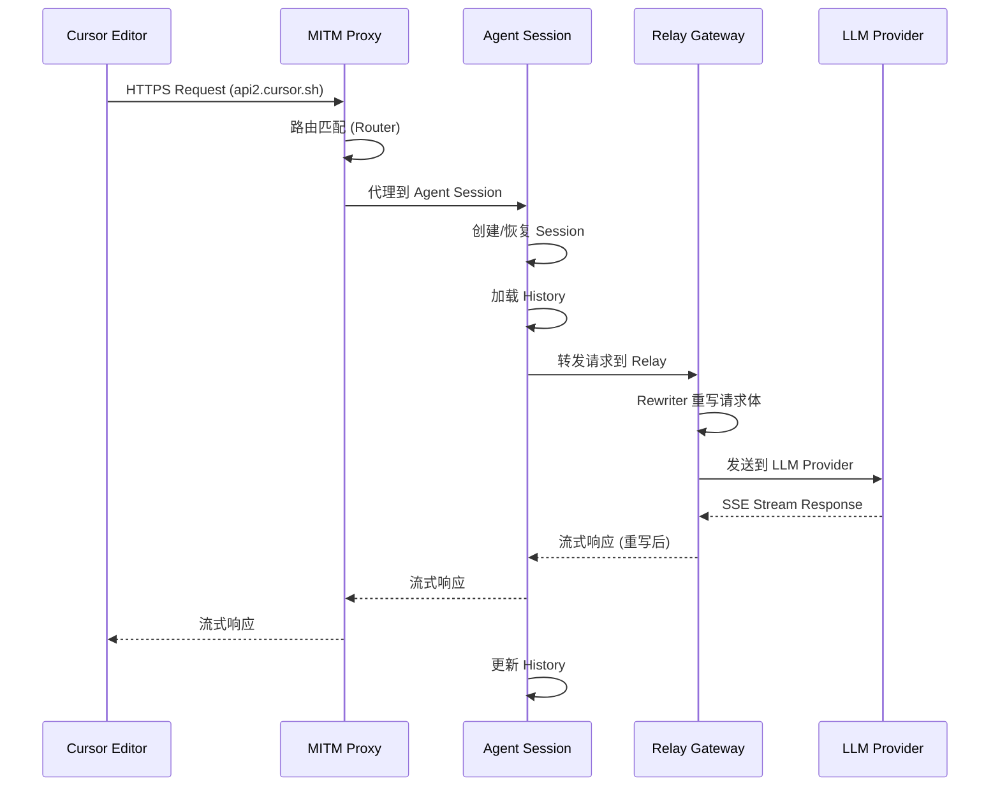
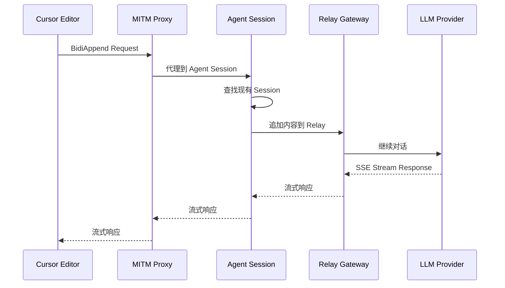
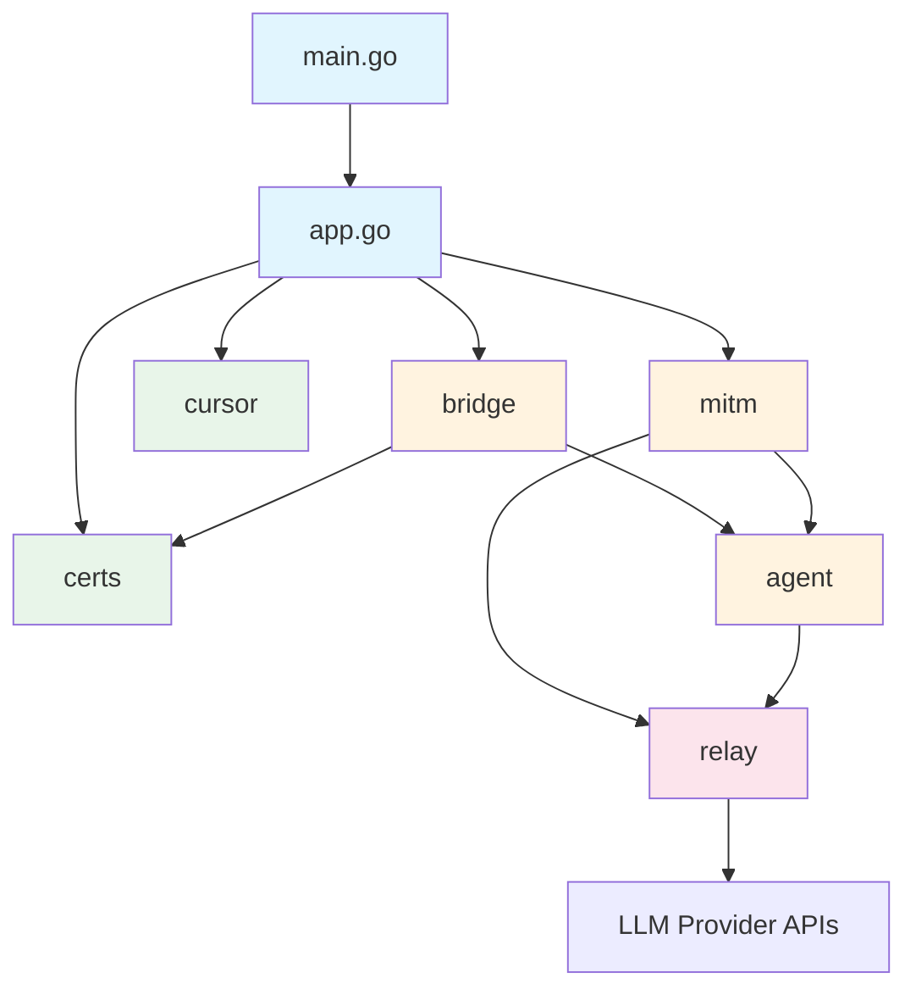

# 系统架构设计

## 架构总览

Cursor BYOK 采用分层代理架构，核心由四个层组成：

```
┌─────────────────────────────────────────────────┐
│                   Cursor Editor                  │
│              (HTTPS Client)                      │
└───────────────────────┬─────────────────────────┘
                        │ HTTPS (本地 CA 签名)
                        ▼
┌─────────────────────────────────────────────────┐
│                 MITM Proxy Layer                 │
│  ┌─────────┐  ┌──────────┐  ┌───────────────┐  │
│  │ Router  │  │ Handler  │  │   Server      │  │
│  │(路由规则)│  │(请求处理) │  │ (生命周期管理) │  │
│  └─────────┘  └──────────┘  └───────────────┘  │
└───────────────────────┬─────────────────────────┘
                        │
                        ▼
┌─────────────────────────────────────────────────┐
│                Agent Session Layer               │
│  ┌──────────┐ ┌─────────┐ ┌──────────────────┐ │
│  │ Session  │ │ History │ │   Provider       │ │
│  │(会话管理) │ │(历史记录)│ │ (OpenAI/Anthropic)│ │
│  └──────────┘ └─────────┘ └──────────────────┘ │
│  ┌──────┐ ┌─────────┐ ┌──────────────────────┐ │
│  │Tools │ │Composer │ │     BugBot           │ │
│  │(工具) │ │(后台生成)│ │     (问题检测)       │ │
│  └──────┘ └─────────┘ └──────────────────────┘ │
└───────────────────────┬─────────────────────────┘
                        │
                        ▼
┌─────────────────────────────────────────────────┐
│               Relay Gateway Layer                │
│  ┌──────────────┐  ┌──────────────────────────┐│
│  │   Gateway    │  │       Rewriter           ││
│  │  (请求转发)   │  │  (请求/响应重写)          ││
│  └──────────────┘  └──────────────────────────┘│
└───────────────────────┬─────────────────────────┘
                        │ HTTPS (User API Key)
                        ▼
┌─────────────────────────────────────────────────┐
│              LLM Provider APIs                   │
│         (OpenAI / Anthropic / Others)            │
└─────────────────────────────────────────────────┘
```

## 核心数据流

### 1. 请求处理流程 (RunSSE)



### 2. 双向追加流程 (BidiAppend)



## 关键设计决策

### D1: MITM 代理方案

**决策**: 使用本地 MITM 代理拦截 Cursor 到 api2.cursor.sh 的请求。

**原因**: Cursor 编辑器的 API 调用是加密的 HTTPS，无法直接修改请求。通过安装本地 CA 证书，可以在本地解密、重写、再加密请求。

**权衡**: 需要用户手动安装 CA 证书，增加了使用门槛；但这是在不修改 Cursor 编辑器本身的前提下实现 BYOK 的唯一可行方案。

### D2: Agent 会话模型

**决策**: 每个 Cursor 请求创建一个 Agent Session，通过 Session ID 关联后续的 BidiAppend 请求。

**原因**: Cursor 的对话模式是多轮交互的，需要维护上下文状态。Session 模型可以：
- 保持对话历史连续性
- 支持工具调用和结果回传
- 支持后台 Composer 的并行生成

### D3: 请求重写层

**决策**: 在 Relay Gateway 中实现请求/响应重写，而非在 MITM 层。

**原因**: 
- 职责分离：MITM 层只负责拦截和路由，不关心业务逻辑
- 可测试性：重写逻辑可以独立测试
- 可扩展性：新增模型适配只需修改 Rewriter

### D4: Wails 桌面框架

**决策**: 使用 Wails (Go + Vue 3) 构建管理界面。

**原因**: 
- Go 后端可以直接调用内部包
- Vue 3 前端轻量且响应式
- 单一可执行文件分发，无需额外依赖

## 依赖关系图



## 依赖方向规则

1. **单向依赖**: 上层包可以依赖下层包，禁止反向依赖
2. **层级定义**:
   - **入口层**: `main`, `app` — 依赖所有包
   - **服务层**: `bridge`, `mitm` — 依赖核心层
   - **核心层**: `agent`, `relay` — 无外部依赖
   - **基础层**: `certs`, `cursor` — 独立工具包
3. **禁止循环依赖**: 任何两个包之间不允许循环 import
4. **跨层通信**: 通过接口解耦，不直接依赖具体实现
